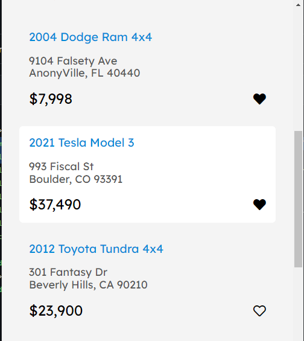
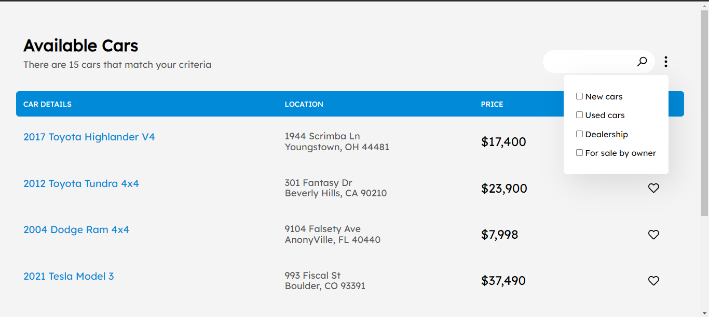

# The Best Cars Simple Project 🚘 🚗

> https://cars-simple-project.netlify.app/

> There are 15 cars that match your criteria

-----


### Mobile 📱📲





### Tablet 📱 💻


### Descktop 💻





-----

### _Available Cars_
There are 15 nice **_Cars_** that match your criteria. 
Following, we wanna show you few of them. 

1. 2017 Toyota Highlander V4
  + Youngstown, OH 44481
  + $17,400

2. 2012 Toyota Tundra 4x4
  + 301 Fantasy Dr Beverly Hills, CA 90210
  + $23,900

3. 2004 Dodge Ram 4x4
  + 9104 Falsety Ave AnonyVille, FL 40440
  + $37,490

4. 2021 Tesla Model 3
  + 993 Fiscal St Boulder, CO 93391
  + $37,490

5. 2012 Toyota Tundra 4x4
  + 301 Fantasy Dr Beverly Hills, CA 90210


------


## Languages and Tools are used 📒📝

1. **Languages** 🗣 🖍
    + [HTML](https://github.com/topics/html)
    + [HTML5](https://github.com/topics/html5)
    + [CSS](https://github.com/topics/css)
    + [CSS3](https://github.com/topics/css3)
    + [JavaScript](https://github.com/topics/javascript)

2. **Tools** 🔧 🔨
    + [Chrome](https://github.com/topics/chrome)
    + [VSCode](https://github.com/topics/vscode)
    + [Figma](https://github.com/topics/figma)
    + [Netlify](https://github.com/topics/netlify)

-----


## For cloning the project 🪛 📌

```
# Clone this repository
$ gh repo clone MastooraTurkmen/Cars-Project

# Go inside the repository
$ cd cars-project
```

## Deployment 📥 📦

1. How to deploy our project to netlify site?
2. I use [Netlify App](https://app.netlify.com/) for deploying my projects.
3. Go to Netlify site and select Add a new site.
4. From there select **_Deploy with Github_**.
5. Then write your project name and select it.
6. After selecting here you can see that the project **_Review configuration for Cars-Project_** and then select the **_Deploy Cars-Project_** Button. 
7. Now your project is Live.


-----

## Author 👩🏻‍💻 

**Mastoora Turkmen**  
[LinkedIn](https://www.linkedin.com/in/mastoora-turkmen/) 
[Github](https://github.com/MastooraTurkmen/) 
[Twitter](https://twitter.com/MastooraJ22)
